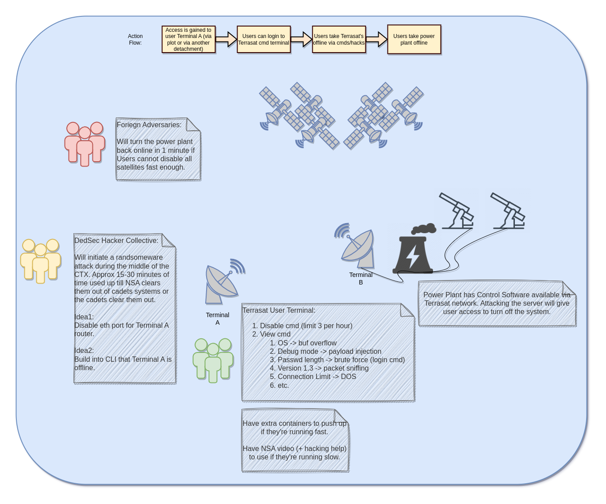

# CTX4 - Operation DedSec

Welcome to Operation DedSec, a Cyber Training Exercise (CTX) designed for i5 cadets.

This CTX was designed to test cadets for leadership competencies in a high intensity simulation. This simulation will be carried out in both the land domain and in the cyber domain.

Tentative system diagram:

### Objectives

Estimated skills (see [skill levels](https://github.com/CyberTrainingExercise/Docs/blob/master/ctx_requirements.md) for meaning)
- Programming skills required (0-3)
    - #TODO
- System adminitration skills required (0-3)
    - #TODO
- Pentesting skills required (0-3)
    - #TODO

Total time: 4 hours
 - 30 mins for planning
 - 3.5 hours for execution

Technical Objectives:
1. #TODO

### Requirements

If you would like to perform this CTX you will need the following:

1. An Admin who is technically skilled to setup the scenario.
    - Hopefully this guide will make it easy, but you still need technical know how to do it.
    - Required skills:
        - #TODO
2. The following equipment:
    - #TODO

### Expected Design

- #TODO

### Scenario

- #TODO

### Difficulty Dials

- #TODO

### Docs

- #TODO

### Setup

- Netclient Setup:

See: https://netmaker.readthedocs.io/en/master/netclient.html#netclient--page-root

### Onsite Setup

- #TODO

### Debrief Ideas

- #TODO

### Misc: Opfor Guidance

- #TODO