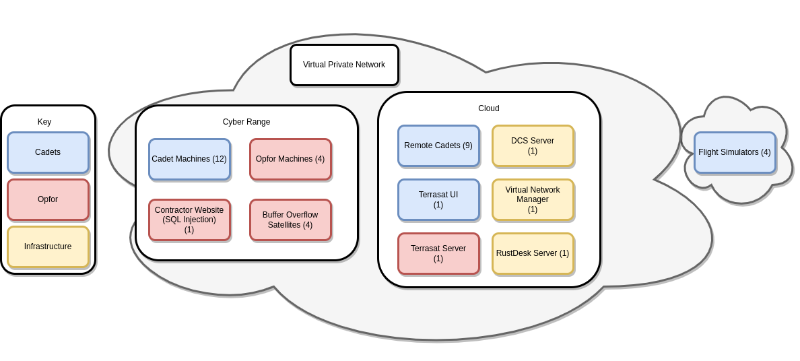

# WIP Statement

Operation Black0ut is not only the largest and most complex CTX ever created, it took 4 hours and ~70 cadets to simply excute. Currently this repository contains all of the needed code, but the specifics for orchestration are not up to repository standards. It is currently recommended as a resource for jump-starting a personalized CTX, but not as a stand-alone CTX. See [Operation Starcom](https://github.com/CyberTrainingExercise/Starcom) for a scaled down version.

# CTX - Operation Black0ut

Welcome to Operation Black0ut, a Cyber Training Exercise (CTX) designed for i5 cadets.

This CTX was designed to test cadets for leadership competencies in a high intensity simulation. This simulation will be carried out in the cyber domain with optional intel, ground combat, and virtual air components.

## System Overview

Below is the recommended system diagram. Changes in scale are encouraged to meet particular needs.

### Objectives

Estimated skills (see [skill levels](https://github.com/CyberTrainingExercise/Docs/blob/master/ctx_requirements.md) for meaning)
- Programming skills required (0-3)
    - 1
- System adminitration skills required (0-3)
    - 2
- Pentesting skills required (0-3)
    - 2

Total time: 4 hours
 - 30 mins for planning
 - 3.5 hours for execution

Technical Objectives:
1. Brute Force Cracking w/ Python
2. Packet Sniffing w/ Wireshark
3. SQL Injection
4. XOR Key Decryption
5. Network scanning w/ nmap

### Requirements

If you would like to perform this CTX you will need the following:

1. An Admin who is technically skilled to setup the scenario.
    - Hopefully this guide will make it easy, but you still need technical know how to do it.
    - Required skills:
        - Linux
        - Python
        - Wireshark
        - SQL Injection
        - XOR Decryption
        - Nmap
        - Brute force
        - Openstack (or similar cloud services)
        - Netmaker & Wireguard for VPN
    - Recommended skills:
        - Rust
        - Bash
        - Javascript
1. The following equipment:
    - Recommended mock "operations center" for 15+ people
    - Recommended 15 workstations
    - Recommended cloud service with >64GB RAM >16 VCPUs

### Expected Design

- Operation Black0ut is designed to mimic an active operations center engaged in offensive cyber warfare, ground combat, and air combat. A genuine showcase of multi-domain combat for cadets.

- It should be noted that Operation Black0ut will greatly depend on the facilities and manpower available. It will need to be adapted, at least in some respects, to fit personalized needs.

### Scenario

#### Objective

Infiltrate and disable the Terrasat satellite network through ground operations and hacking in order to allow an airstrike on an enemy target.

#### Background

Please see the [video](https://www.youtube.com/watch?v=hTQ4KaXyRTo). Optionally, the text verion is included below.

A foreign military power has built a powerful satellite network called Terrasat. Used for ISR, missile guidance, comms, and jamming, Terrasat boasts as the foremost space asset in the enemy arsenal. Your mission is to disable Terrsat for a 2 hour window in order to allow an airstrike on a high value target. Currently, an airstrike is not possible as Terrasat’s advanced detection and long-range missile defense systems would destroy any aircraft long before it reached the target. The high value target in question is an almost completed Artificial Intelligence platform that would make the US Military obsolete almost overnight. With recent Intel reports suggesting only hours remain before this AI is operational, you must act fast. Good luck.

#### Execution

1. Capture a Terrasat ground terminal and gain access to the network.
1. Hack into the network via the ground terminal and disable all satellites.
1. Strike the target.

### Difficulty Dials

- #TODO

### Docs

- #TODO

### Setup

- #TODO

### Onsite Setup

- #TODO

### Debrief Ideas

- #TODO

### Misc: Opfor Guidance

- #TODO
